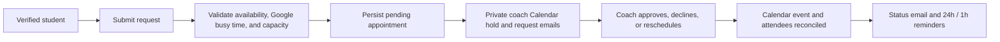
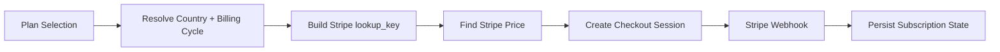

# BookMePro


Production-grade booking and subscription platform for coaches and service professionals.

BookMePro is built with Next.js App Router and includes profile management, role-based dashboards, capacity-safe bookings, Google Calendar synchronization, Brevo transactional email, dynamic plan pricing, and Stripe checkout flows.

---

## Contents

- 1. Platform Summary
- 2. Feature Matrix
- 3. Architecture
- 4. Domain Flow Diagrams
- 5. Repository Map
- 6. Quick Start
- 7. Environment Configuration
- 8. Stripe Pricing Model
- 9. API Surface Overview
- 10. Development Standards
- 11. Scripts and Tooling
- 12. Testing and Quality Gates
- 13. Release and Deployment
- 14. Security and Operational Practices
- 15. Troubleshooting Runbook
- 16. Maintenance Checklist
- 17. Contribution Guide

---

## 1. Platform Summary

BookMePro supports three primary surfaces:

- Public pages for discovery and onboarding
- Coach and student booking workflows
- Admin and operational dashboards

Core business capabilities:

- Coach profile publishing and booking links
- Appointment request lifecycle and status handling
- Country-aware pricing and billing-cycle logic
- Stripe checkout and subscription webhooks
- Auth via NextAuth (credentials + Google)
- Verified student accounts and coach-scoped student onboarding
- Google Calendar conflict checks for coaches and students
- Coach-owned Calendar events, optional Google Meet, and push-webhook reconciliation
- Idempotent booking emails and reminders via Brevo
- Media upload integration via Cloudinary

---

## 2. Feature Matrix

| Area | Capability | Notes |
| --- | --- | --- |
| Authentication | Session auth, Google OAuth, role-aware routing | NextAuth-backed |
| Booking | Request creation, status updates, coach/student views | API-driven |
| Booking integrity | Idempotency, optimistic versions, capacity reservation/release | Handles retries and concurrent booking |
| Google Calendar | Coach event sync, pending holds, Meet links, free/busy checks | Encrypted offline tokens and push watches |
| Student Calendar | Optional read-only conflict checking | No student events are created |
| Student accounts | Email verification and verification resend | 24-hour links, 60-second resend cooldown |
| Pricing | Country + billing cycle pricing | Cookie/location aware |
| Payments | Subscription checkout and upgrade | Stripe |
| Notifications | Contact + appointment reminders | Brevo |
| Media | Profile and gallery upload/update | Cloudinary |
| Metadata/SEO | Route metadata, robots, sitemap | App Router metadata routes |
| Admin | Coach/student/booking management | Protected flows |

---

## 3. Architecture

### 3.1 Runtime layers

1. Route layer in app for pages and API endpoints
2. UI/component layer in components for reusable rendering and client islands
3. Integration layer in Lib for auth, DB, Stripe, and server utilities
4. Data layer in models for Mongoose schemas
5. Utility layer in utils and scripts for support operations

### 3.2 Request lifecycle

1. Client requests page or API endpoint
2. Middleware applies auth/geo behavior
3. Route handler calls shared integrations from Lib
4. Database/provider operations execute
5. Durable outbox work is queued for Calendar and email providers
6. Immediate delivery is attempted; the daily reconciliation cron retries failures
7. Normalized response is returned to the client

---

## 4. Domain Flow Diagrams

### 4.1 Booking lifecycle (high-level)



### 4.2 Google Calendar ownership model

- Coaches connect Calendar with read-only calendar-list/free-busy access plus the least-privilege `calendar.events.owned` scope.
- BookMePro writes only to a calendar owned by the connected coach. Shared calendars with writer access are intentionally not offered as destinations because the OAuth scope does not authorize them.
- Students may connect Calendar for free/busy conflict warnings. BookMePro never writes events to a student calendar.
- Approved students are added to coach-owned events as attendees. Group bookings share one deterministic event.
- Disabling pending holds removes existing pending-only events. Cancelling, declining, completing, or marking the final active attendee no-show removes the event and clears stored links.
- Google push channels notify BookMePro about destination-calendar changes. BookMePro remains the booking source of truth and reconciles managed events from database state.

### 4.3 Subscription checkout flow



---

## 5. Repository Map

| Path | Responsibility |
| --- | --- |
| app | App Router pages, API routes, metadata routes |
| components | Shared UI and interactive components |
| Lib | DB/auth/Stripe integration helpers |
| models | Domain schemas |
| utils | Shared utility functions |
| scripts | Maintenance and one-off operational scripts |
| tests | Automated test files |
| public | Static media and assets |
| data | Static JSON/config data |

---

## 6. Quick Start

### 6.1 Prerequisites

- Node.js 18+
- npm
- MongoDB (Atlas or local)
- Stripe account
- Google OAuth app
- Brevo account and API key
- Cloudinary account

### 6.2 Install

```bash
npm install
```

### 6.3 Configure environment

```bash
cp .env.example .env.local
```

Update .env.local with real values.

### 6.4 Run locally

```bash
npm run dev
```

Local URL:

- http://localhost:3000

---

## 7. Environment Configuration

The source of truth is .env.example.

### 7.1 Environment variable matrix

| Variable | Required | Used For |
| --- | --- | --- |
| MONGODB_URI | Yes | Database connection |
| MONGODB_DB | Yes | Database selection |
| NEXTAUTH_SECRET | Yes | NextAuth signing secret |
| NEXTAUTH_URL | Yes | Auth callback base URL |
| JWT_SECRET | Yes | Token verification utilities |
| GOOGLE_CLIENT_ID | Yes | Google login OAuth |
| GOOGLE_CLIENT_SECRET | Yes | Google login OAuth |
| GOOGLE_CALENDAR_CLIENT_ID | Yes | Calendar OAuth client |
| GOOGLE_CALENDAR_CLIENT_SECRET | Yes | Calendar OAuth client |
| GOOGLE_CALENDAR_REDIRECT_URI | Yes | Exact Calendar OAuth callback |
| GOOGLE_CALENDAR_TOKEN_ENCRYPTION_KEY | Yes | AES-256-GCM encryption key material |
| GOOGLE_CALENDAR_STATE_SECRET | Yes | OAuth state signing; falls back to NEXTAUTH_SECRET |
| GOOGLE_CALENDAR_WEBHOOK_URL | Yes | Public HTTPS Google push callback |
| STRIPE_SECRET_KEY | Yes | Stripe server API |
| STRIPE_SECRET | Optional | Legacy fallback key |
| STRIPE_WEBHOOK_SECRET | Yes | Stripe webhook validation |
| BREVO_API_KEY | Yes | Transactional email and scheduled reminders |
| BREVO_SENDER_EMAIL | Yes | Verified Brevo sender |
| BREVO_SENDER_NAME | Yes | Transactional sender name |
| BREVO_WEBHOOK_SECRET | Yes | Delivery-webhook authentication |
| CONTACT_RECIPIENT_EMAIL | Yes | Contact-form destination |
| CRON_SECRET | Recommended | Protecting Vercel cron endpoints |
| CLOUDINARY_CLOUD_NAME | Yes | Media provider config |
| CLOUDINARY_API_KEY | Yes | Media provider config |
| CLOUDINARY_API_SECRET | Yes | Media provider config |
| NEXT_PUBLIC_BASE_URL | Yes | Public absolute links |
| NEXT_PUBLIC_DOMAIN | Optional | Legacy URL fallback |
| NEXT_PUBLIC_SITE_URL | Yes | Metadata/robots/sitemap host |
| NODE_ENV | Optional | Runtime mode |

### 7.2 Production recommendations

- Use HTTPS URLs for all public/auth URL variables.
- Use long random secrets for NEXTAUTH_SECRET and JWT_SECRET.
- Set CRON_SECRET in Vercel production so scheduled reminder routes only accept Vercel cron invocations.
- `vercel.json` intentionally uses one daily `/api/cron` invocation for Vercel Hobby compatibility. Booking mutations also drain their own outboxes immediately, while Brevo holds future 24-hour and 1-hour sends. The daily job renews Google watches, retries outboxes, and schedules reminders that enter Brevo's 72-hour scheduling window.
- Restrict and rotate provider keys regularly.
- Keep environment values isolated per environment (dev/staging/prod).

---

## 8. Stripe Pricing Model

BookMePro does not rely on env-based hardcoded Stripe price IDs.

Price resolution is dynamic through Stripe lookup_key.

Expected lookup_key pattern:

- plan_billingCycle_countryCode
- lowercase

Examples:

- starter_monthly_au
- growth_quarterly_us
- pro_yearly_default

If matching lookup keys are missing in Stripe, checkout session creation fails by design.

---

## 9. API Surface Overview

API routes are organized by domain area:

- Authentication and account operations
- Booking and calendar operations
- Coach/student/admin management
- Stripe checkout, upgrade, webhook, payment-method operations
- Contact and reminder email operations

Design notes:

- Validation is performed per route before persistence/provider calls.
- Integrations are centralized in shared helpers where possible.
- Some routes are externally triggered (webhooks/cron) and may not have internal callers.

---

## 10. Development Standards

Recommended workflow for every meaningful change:

1. Pull latest branch state.
2. Confirm local env values.
3. Implement focused changes.
4. Run lint + tests.
5. Run production build for non-trivial edits.
6. Confirm route-level behavior manually for touched user flows.

Coding standards:

- Keep server and client concerns separated where practical.
- Prefer small focused components over monolithic interactive pages.
- Avoid introducing unused assets/routes/modules.
- Keep docs and env template synchronized with implementation.

---

## 11. Scripts and Tooling

### 11.1 NPM scripts

```bash
npm run dev
npm run build
npm run start
npm run lint
npm test
npm run migrate:calendar
npm run migrate:calendar:apply
```

### 11.2 Script meanings

- dev: local development server
- build: optimized production build
- start: run built app
- lint: repository lint checks
- test: test suite in tests
- migrate:calendar: read-only booking/calendar migration preview
- migrate:calendar:apply: backup the affected collections to `/tmp/bookmepro-backups`, normalize production records, reconcile capacity counters, and create required indexes

---

## 12. Testing and Quality Gates

### 12.1 Core quality gates

```bash
npm run lint
npm test
npm run build
```

### 12.2 Recommended pre-merge gate

1. Lint passes
2. Tests pass
3. Build passes
4. Manual smoke test of modified flows

---

## 13. Release and Deployment

### 13.1 Pre-release checklist

1. Run `npm run migrate:calendar` against the target database and resolve every reported failure.
2. Back up the database, then run `npm run migrate:calendar:apply` once per target database.
3. Validate target environment variables without printing secret values.
4. Confirm Google OAuth redirect, authorized domain, privacy policy, Terms, and webhook URLs use the production HTTPS origin.
5. Configure the Brevo delivery webhook as `/api/webhooks/brevo?token=<BREVO_WEBHOOK_SECRET>` and verify its sender.
6. Confirm Stripe webhook configuration and lookup keys.
7. Run lint, tests, and the optimized production build.
8. Smoke-test desktop and mobile auth, booking, Calendar settings, privacy, Terms, and custom 404 pages.

### 13.2 Deployment targets

- Vercel or any Node-compatible hosting platform
- Build/start lifecycle remains standard Next.js

---

## 14. Security and Operational Practices

- Never commit real local env files.
- Avoid exposing server secrets to client-side code.
- Calendar access and refresh tokens are encrypted at rest with AES-256-GCM.
- OAuth state is HMAC authenticated, short-lived, and bound to the signed-in owner.
- Google and Brevo webhooks verify unguessable server-side secrets before processing.
- Booking writes require role/ownership checks, optimistic versions, idempotency keys, and atomic capacity counters.
- Verification-resend responses do not reveal whether an email address is registered.
- Rotate third-party provider credentials periodically.
- Keep webhook and OAuth secrets isolated per environment.
- Monitor auth/payment/email failures through logs and alerting.

---

## 15. Troubleshooting Runbook

### 15.1 Auth issues

- Verify NEXTAUTH_URL and NEXTAUTH_SECRET.
- Verify Google OAuth callback URL configuration.
- For an unverified student, use **Resend verification email** on student login; links expire after 24 hours.

### 15.2 Google Calendar issues

- Confirm all `GOOGLE_CALENDAR_*` variables are present and the redirect URI exactly matches Google Cloud.
- A destination calendar must have Google access role `owner`; writer-only shared calendars are deliberately excluded.
- Check the Calendar settings `lastError`, Vercel function logs, `calendarOutbox`, and `CalendarConnection.status` (`needs_reauth` means Google revoked/expired the grant).
- Manual **Sync now** force-requeues future managed appointments; the daily cron also renews watch channels.

### 15.3 Stripe checkout issues

- Verify STRIPE_SECRET_KEY and STRIPE_WEBHOOK_SECRET.
- Verify lookup_key naming and existence in Stripe dashboard.

### 15.4 Metadata/canonical issues

- Verify NEXT_PUBLIC_SITE_URL.

### 15.5 Email issues

- Verify `BREVO_API_KEY`, the verified sender, and `BREVO_WEBHOOK_SECRET`.
- Inspect `notificationOutbox` for retry/dead status and `emailDeliveries` for provider delivery events.
- Reminder scheduling is limited to 72 hours ahead by Brevo; the daily reconciliation job schedules appointments as they enter that window.
- Booking requests notify both student and coach. Approval and decline notify the student; cancellation and rescheduling notify both parties with actor-aware copy; completion and no-show status changes notify the student. Approved bookings schedule 24-hour and 1-hour reminders.
- Booking actions attempt Calendar synchronization and Brevo delivery inline. The single daily `/api/cron` entry is the Vercel Hobby-compatible reconciliation and retry safety net, so no paid-frequency cron is required.
- The same daily reconciliation verifies the authenticated Brevo transactional delivery webhook and repairs its endpoint, event subscriptions, or secret header when needed.

### 15.6 Booking/capacity issues

- Run the calendar migration in dry-run mode first. Applying it recalculates every `bookingCapacity.activeCount` from active (`pending`/`approved`) appointments.
- Never edit capacity counters manually without reconciling the corresponding appointment statuses.

---

## 16. Maintenance Checklist

Run this periodically:

1. Remove dead assets/routes/components conservatively.
2. Keep .env.example aligned with process.env usage.
3. Revalidate pricing lookup keys against Stripe products.
4. Re-run lint, tests, and build after dependency updates.

---

## 17. Contribution Guide

Before opening a pull request:

1. Keep the change focused and documented.
2. Run lint, tests, and build.
3. Update .env.example and README if configuration changed.
4. Include migration or rollback notes for behavior changes.

Thanks for improving BookMePro.
